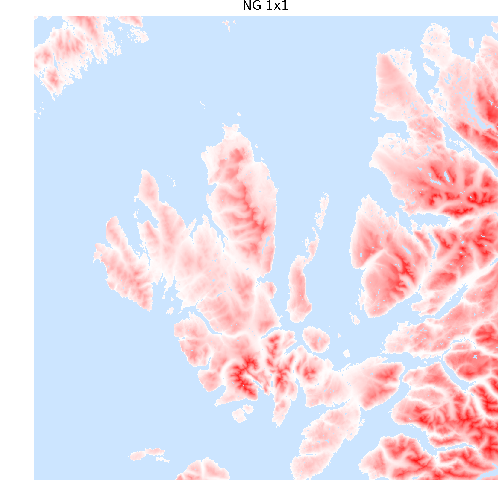

#PythonOSMapData
Python programs which process [Ordnance Survey Open Data sets](https://www.ordnancesurvey.co.uk/opendatadownload/products.html). 

Initially for generation of images showing land topography based on the altitude grid data within the OS 'Terrain 50' data set. This provides altitude data for squares of size 50mx50m. 

The OS data does not indicate the location of lakes, sea, etc, so the program attempts to deduce this. Still work-in-progress, finding some false lakes, especially in flat coastal areas.

## Examples ##

The OS National Grid square **NY**, which covers much of the Lake District and beyond

Grid square **NG**, which covers the Isle of Skye, shown using e.g. a red-based colour-scheme. 

*[Contains OS data © Crown copyright and database right (2018)](https://www.ordnancesurvey.co.uk/business-and-government/licensing/using-creating-data-with-os-products/os-opendata.html)*

